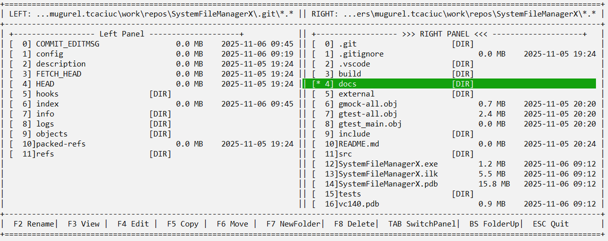
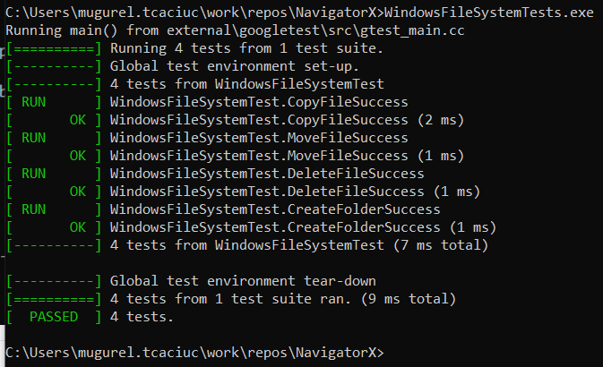

# SystemFileManagerX

**SystemFileManagerX** is a modern C++17 console-based File Manager for Windows and Linux.
It provides a fast, keyboard-driven interface for navigating directories, managing files, and exploring your system in a dual-pane layout.
---
## Features

- Dual-panel interface (left and right)
- Keyboard navigation
- File operations using function keys:
  - F2 - Rename file
  - F3 - View file content
  - F4 - Edit file (opens in Notepad)
  - F5 - Copy file to other panel
  - F6 - Move file to other panel
  - F7 - Create new folder
  - F8 - Delete file
  - TAB - Switch active panel
  - BACKSPACE - Go up one folder
  - ESC - Exit
-  Automatic screen refresh when changing directories
-  Cross-platform (Windows, Linux – uses 'std::filesystem')

---

### Screenshot
Here's a preview of SystemFileManagerX in action:

---

### Unit Tests
SystemFileManagerX includes unit tests for core file system operations using Google Test and Google Mock. Here's a snapshot of the test suite in action:


---

##   Technologies

- **Language:** C++17
- **Standard library:** '<filesystem>', '<thread>', '<iomanip>', '<iostream>'
- **Compiler support:** GCC, Clang, MSVC


##  Usage

1. **Clone the repository**
   '''bash
   git clone https://github.com/mugureltcaciuc/SystemFileManagerX.git
   cd SystemFileManagerX

2. **Build the project**

    g++ -std=c++17 -O2 -o SystemFileManagerX src/*.cpp


3. **Run the File Manager**
   '''bash
   ./SystemFileManagerX

## 4. Controls

SystemFileManagerX is fully keyboard-driven. Use the following keys to navigate and manage files:

- 'TAB' – Switch active panel
- 'BACKSPACE' – Go up one folder
- 'ESC' – Exit the application
- 'F2' – Rename selected file
- 'F3' – View file content
- 'F4' – Edit file in Notepad
- 'F5' – Copy file to other panel
- 'F6' – Move file to other panel
- 'F7' – Create new folder
- 'F8' – Delete selected file


5. **Project Structure**

Project Structure
```
SystemFileManagerX/
|-- src/
|   |-- main.cpp
|   |-- FileManager.cpp
|   |-- FileManager.h
|   |-- FileSystemFactory.cpp
|   |-- FileSystemFactory.h
|   |-- WindowsFileSystem.cpp
|   |-- WindowsFileSystem.h
|   |-- IFileSystem.h
|-- tests/
|   |-- WindowsFileSystemTests.cpp
|-- external/
|   |-- googletest/
|   |-- googlemock/
|-- docs/
|   |-- screenshots/
|       |-- systemfilemanagerx_dual_panel.png
|       |-- windows_file_system_tests.png
|-- .vscode/
|   |-- c_cpp_properties.json
|   |-- launch.json
|   |-- settings.json
|   |-- tasks.json
|-- README.md
|-- LICENSE
```


6. **Planned Improvements**

    - Color themes for directory panels
    - Command-line integration
    - Add support for Linux and cross-platform compatibility
    - Implement file preview with paging and syntax highlighting
    - Add customizable key bindings
    - Improve error handling and user feedback
    - Add search functionality within panels
    - Support for renaming folders and batch operations

7.  **License**

    This project is licensed under the MIT License.
    See the LICENSE file for details.
